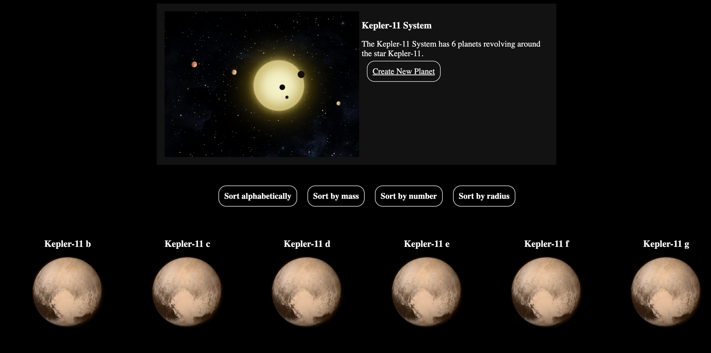
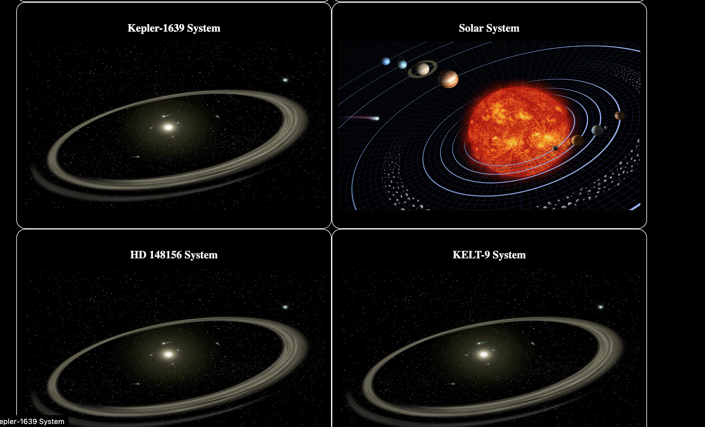

# Solar System Website Using Java/Javalin/Vue
##### This WebPage is Fully customizable for whatever usage you want!

### Solar System Application:
This Solar System Application is mainly built using Java. It Uses Custom Controllers and basic Celestial Body Models.  
It has possibility to use JSON and CSV Format. I Just prefer CSV (Hence why i put more work in to that specific repo.)  
Mainly For School type of Work as i dont see much usage of this exact page for anything else. Can be customized so you do you.  
Vue Components Can be Found under Resources/vue/views. This can be used to edit the pages and their functionality.  
Not much work put in to the website part as i mainly focus on functionality.

### Requirements:

#### Java: JDK 13

##### NB Will not Work on Java 16+. Changes is Planned in Future...

#### Gradle:
1. group: 'junit', name: 'junit', version: '4.12'
2. 'io.javalin:javalin:3.7.0'
3. 'com.fasterxml.jackson.module:jackson-module-kotlin:2.9.9'
4. 'org.slf4j:slf4j-simple:1.7.26'
5. 'org.webjars.npm:vue:2.6.10'
6. group: 'com.fasterxml.jackson.core', name: 'jackson-databind', version: '2.0.1'

## PS! Important to Keep Gradle Versions! This Site Will NOT Work on Newer Versions!